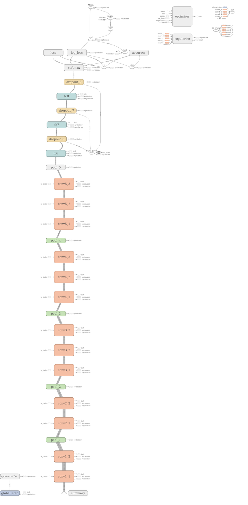
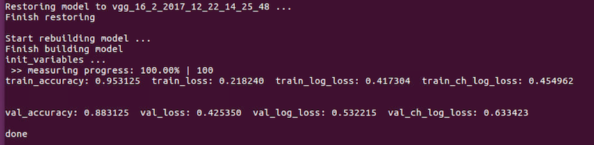
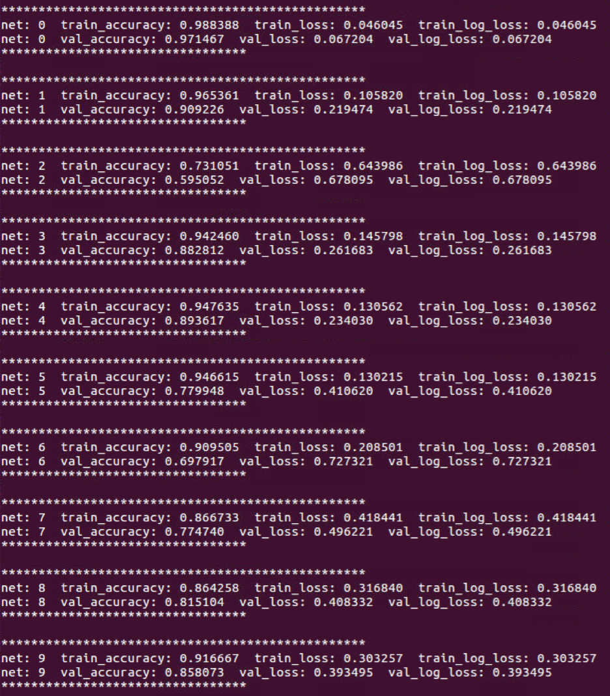
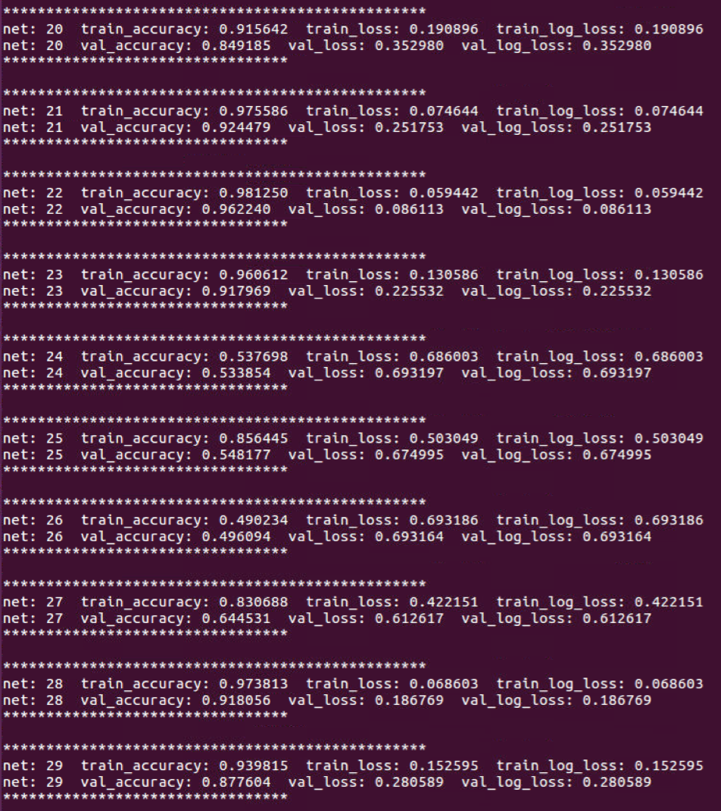
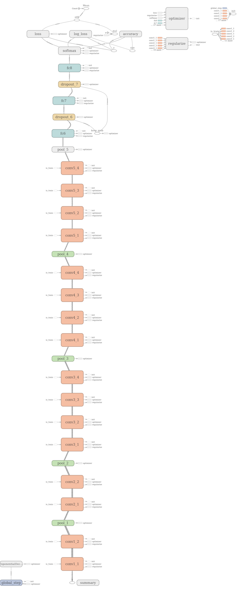
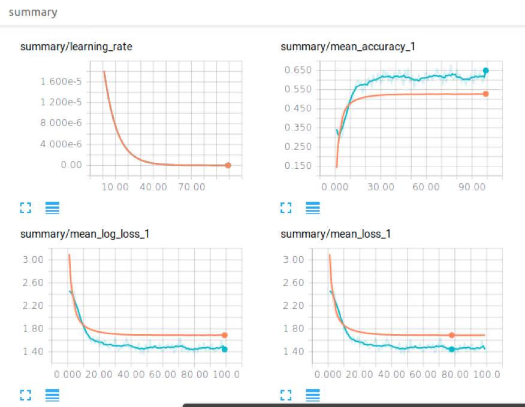

### To classify each pigs out of the images.

##### Use the pigs segmented by FCN as input to the classification model.

>#### File Structure
- [img_arg.py](img_arg.py): Apply data augmentation to the images of the segmented pigs. The augmentation includes rotation, translation, scaling, random cropping, adjusting brightness and chroma, and etc.
- [load.py](load.py): It is the base class for loading data and for downloading data. (In order to speed up the program and ensure that the limit of the memory storage is not exceeded, the asynchronous loading method is adopted. It means that the data is loaded asynchronously on demand in the background instead of being loaded into the memory all at once.)
- [bi_load.py](bi_load.py): The basic class for loading data. (specially for [bi_vgg16_net.py](bi_vgg16_net.py))
- [vgg16_net.py](vgg16_net.py): Apply the VGG16 model to identify the pigs. (The image input size is the same as VGG model's, which is 224 * 224.)
- [vgg16_net_2.py](vgg16_net_2.py): Apply the VGG16 model to identify the pigs. (To speed up the program, the image input size is reduced to 56 * 56.)
- [vgg19_net.py](vgg19_net.py): Apply the VGG19 model to identify the pigs. (To speed up the program, the image input size is reduced to 56 * 56.)
- [bi_vgg16_net.py](bi_vgg16_net.py): Apply the bi-VGG16 model, which is a two-class classification model instead of a multi-class classification model, to identify pigs. There would be 30 networks in this model and each network performs a two-class classification. The classification targets are a pig and the other pigs. Finally, the accuracy of 30 networks are weighted and the results would be used to decide which category to belong to. (To speed up the program, the image input size is reduced to 56 * 56.)
- [resnet_50.py](resnet_50.py): Apply the 50-layers Residual Neural Networks to identify the pigs. (the image input size is 224 * 224.) The Resnet model has not been tried to run yet, but I would try to run it when I am free.
- [get_test_csv.py](get_test_csv.py): Generate the classification result of pigs of the data "data/Test_B".

 

>#### The training method
> Since the scoring standard of the competition is based on log_loss (Please see the details in the official website of the competition.), I adopted the general loss and the log_loss back and forth during the training process.
>
>> 1、First I used the general loss to train the model and adjust the parameters. And then I saved the best result of the training process until it stops or triggers the early stop.
>>
>> 2、On the basis of the trained model in step 1, the loss function is changed to log_loss for training, and the parameters are adjusted. Again saved the lowest result of the log_loss of the test set of the training process until it stops or triggers the early stop.
>>
>> 3、Repeat steps 1 and 2 until the ideal effect is achieved.

 

>### vgg16_net、vgg16_net_2
> The difference between vgg16_net and vgg16_net_2 is the input size, resulting in different number of the parameters of the fully connected layer.
>
> The vgg16_net_2 runs faster than the vgg16_net because of fewer parameters.
>
> The VGG model here adds batch normalization in order to speed up the training process.
>
>##### The Structure Diagram
>
> 
>
>##### The result of running vgg16_net_2
>
> 
>
> As the result of the vgg16_net is similar to the result of vgg16_net_2, I did not wait for the completion of the training process of vgg16_net. Therefore, no results of vgg16_net is provided here.

 

>#### bi_vgg16_net
> There would be 30 networks in this model and each network performs a two-class classification. The classification targets are a pig and the other pigs. Finally, the accuracy of 30 networks are weighted and the results would be used to decide which category to belong to.
>
> <strong>Advantages</strong>：The extensibility. When adding new categories, it is not necessary to retrain all the data. It only needs to train a new network for the new category, which is fast and convenient.
>
> <strong>Fatal Disadvantages</strong>：尽管单个网络的准确率能高达 90+%，但当需要整合 30 个网络时，能保证不出错的概率就变成 0.9 ^ 30 = 0.0424 ，这是一个非常小的数字，意味着当综合考虑时，总会有一些网络会出错出现干扰，导致准确率无法提升
>
> 由于该模型存在致命缺点，这里就不展示它的结构图了，准确率只有 60% 多
>
> 其中 30 个网络的准确率以及 log_loss
>
> 
>
> 
>
> 
>
> 可见单个网络的准确率可以很高，最高 97% - 98%，若给每个网络调一下参数，平均准确率应该能高于 90%；但是关键就在于上面所说的致命弱点
>
> 这里就不展示最终合并在一起的准确率的运行结果图了，之前忘记截图，准确率就 60+%

 

> The structure diagram of the vgg19_net model
>
> 此处的 vgg 模型，加入了 batch_normalize，为了加快训练速度
>
> 
>
> The screenshot of Tensorboard
>
> 
>
> 还没仔细地调参数，目前准确率就 60+%，跟 bi_vgg16 的效果差不多，运行结果图忘记截图了

 

> The structure diagram of the 50-layers Residual Neural Networks
>
> The result is forgot to save and would not be provided here.
