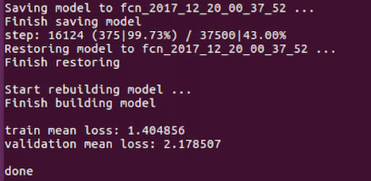
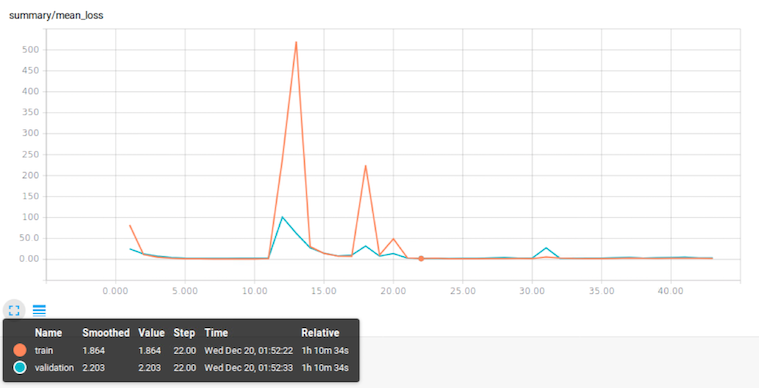
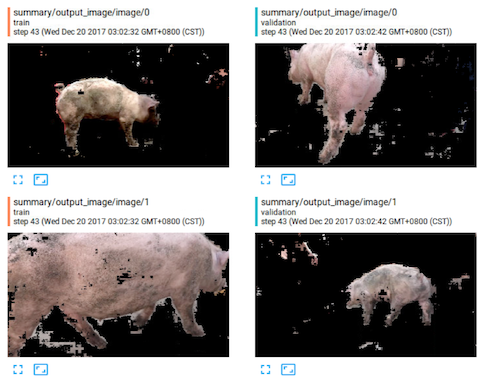
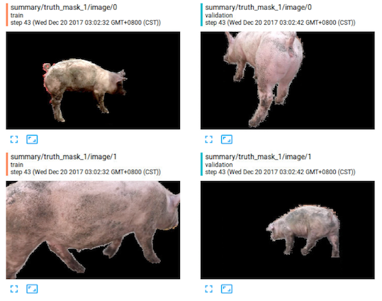

# FCN 全卷积神经网络

##### 负责将猪从图片中切割出来，也就是去掉背景，只留下猪

> FCN 的结构图

> FCN 训练过程 tensorboard 的 scalar

> FCN 训练过程 tensorboard 里的 image
>> 其中 input_image 为输入图像；output_image 为切割后的图像；truth image 为 ground truth

> FCN 运行结果的 cmd 图

> 文档结构
- load.py: 加载数据的基类
- fcn.py: fcn 的模型；继承于 lib/base，运行里面的 FCN.run 即可训练模型
- get_image.py: 引用 fcn.py 将 data/TrainImg 里的猪切割出来
- get_test_image.py: 引用 fcn.py 将 data/Test_B 里的猪切割出来

