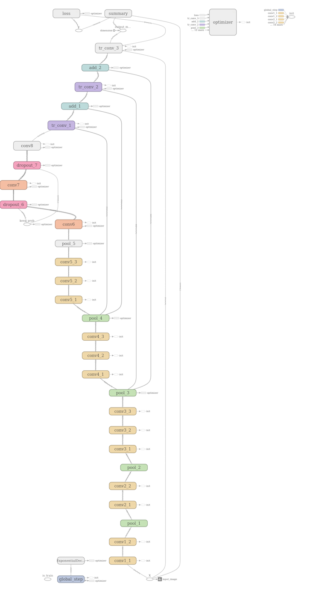

# FCN: Fully Convolutional Networks for Pigs Segmentation

##### Responsible for segmenting the pigs out of the pictures, that is, removing the background and leaving only the pigs individually.

> The structure diagram of FCN.
>
> 

> The scalar of Tensorboard of the training process of FCN.
>
> 

> The image of Tensorboard of the training process of FCN.
>> Among them, the "input_image" is the input image, the "output_image" is the image of pigs after segmentation and the "truth mask" is the image of ground truth.
>
> 
>
> 
>
> 

>#### The screenshot of the CMD of the training process of FCN.
>
> 

>#### File structure.
- [load.py](load.py): The base class for loading data.
- [fcn.py](fcn.py): Fcn model. It inherits from "lib/base". You can train the model by running the function FCN.run.
- [get_image.py](get_image.py): It applies fcn.py to segment the pigs of data/TrainImg individually.
- [get_test_image.py](get_test_image.py): It applies fcn.py to segment the pigs of data/TestB individually.
